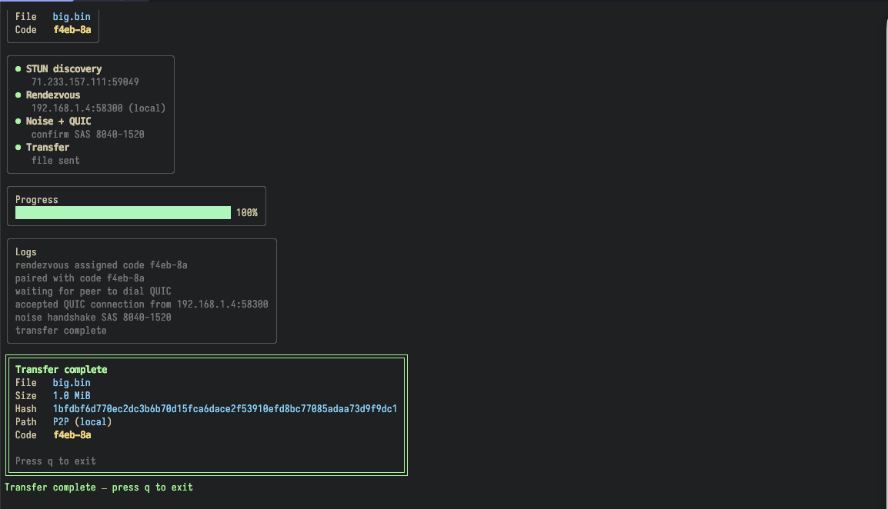

# Wormzy

Wormzy aims to be simple and secure way to share large files with another party.

Wormzy allows users to send files directly to another party with ease. Its primary features
include:

* Send file of any size peer-to-peer. No need to change NAT rules.
* Communication is secure/encrypted
* Utilizes QUIC for fast transfers.


## Quick Start

Install the `wormzy` CLI:

```bash
go install github.com/jdefrancesco/cmd/wormzy@latest
```

On the sender:

```bash
wormzy send ./big.bin
# => displays a pairing code such as f7p9-x2
```

On the receiver (on another terminal/machine):

```bash
wormzy recv
# prompted for the pairing code, then the file arrives
```

## Screenshots

Add screenshots (or a short screencast thumbnail) under `docs/screenshots/` and link them here.

<!-- Example:


-->

## Security Policy

TBD

## Reporting a Vulnerability

Please email jdefr89@gmail.com.
