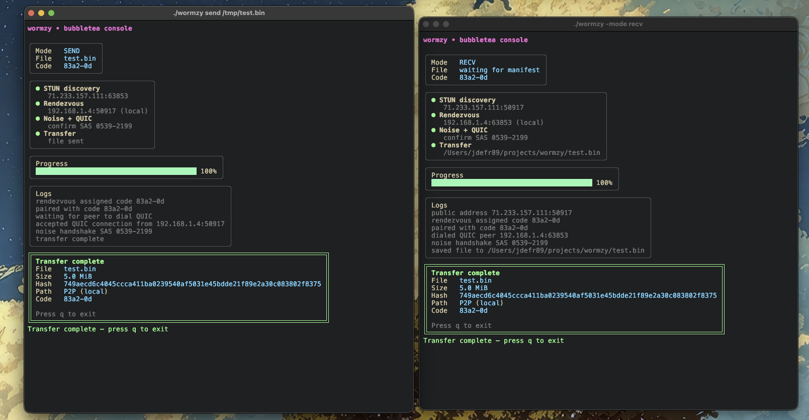

# Wormzy

Wormzy aims to be simple and secure way to share large files with another party.

Wormzy allows users to send files directly to another party with ease. Its primary features
include:

* Send file of any size peer-to-peer. No need to change NAT rules.
* Communication is secure/encrypted
* Utilizes QUIC for fast transfers.


## Quick Start

Install the `wormzy` CLI:

```bash
go install github.com/jdefrancesco/cmd/wormzy@latest
```

On the sender:

```bash
wormzy send ./big.bin
# => displays a pairing code such as f7p9-x2
```

On the receiver (on another terminal/machine):

```bash
wormzy recv
# prompted for the pairing code, then the file arrives
```

By default the receiver saves into the current working directory. Override this with
`wormzy recv -download-dir ~/Downloads`—Wormzy will create the directory if needed and
will refuse the transfer up front if the filesystem cannot hold the advertised file size.

## Testing

Run `make test` to exercise all non-mvp packages.

Focused sweeps:
- `make test-transport` — transport unit tests.
- `make test-stun` — STUN socket tests (auto-skip when UDP is blocked).

Full sweep:
- `make test-all` — runs core, transport, and STUN suites.

The STUN tests bind UDP sockets; they will automatically skip on environments that block UDP (for example, some CI or container sandboxes).

Large transfers run with per-stream idle timeouts; stalled sessions abort instead of hanging. To sanity-check on localhost, run the loopback transfer test: `go test -run TestLargeTransferLoopback ./internal/transport` (skipped automatically with `-short`).

## Deploying updated binaries

On a server with the systemd units installed, run `make deploy`. It builds the binaries, installs them to `/usr/local/bin`, reloads systemd, and restarts `wormzy-mailbox` and `wormzy-rendezvous` (ignored if those services are absent).

## Relay defaults

The CLI ships with a baked-in relay (`https://relay.wormzy.io`). You don’t need to set anything for basic use. To override, pass `-relay ...` or set `WORMZY_RELAY_URL`. A config file at `$XDG_CONFIG_HOME/wormzy/relay` or `/etc/wormzy/relay` is also honored.

## Screenshots

Add screenshots (or a short screencast thumbnail) under `docs/screenshots/` and link them here.

<!-- Example:

-->

## Security Policy

TBD

## Reporting a Vulnerability

Please email jdefr89@gmail.com.
