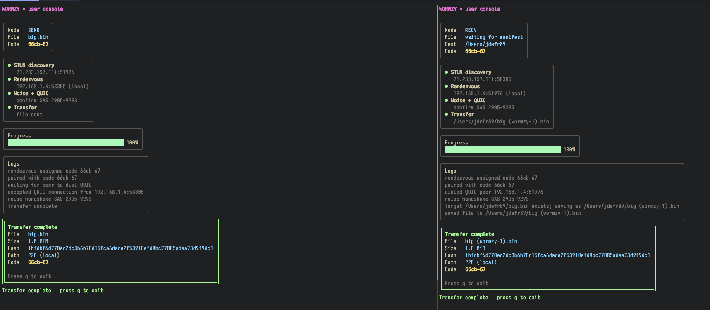

# Wormzy

`wormzy` aims to be a simple, fast, and secure method to share large files with another party peer-2-peer. It's similar to 
[Magic Wormhole](https://github.com/magic-wormhole/magic-wormhole) but it's built on more modern primitives and aims to be far
more portable. 


It's primary features include:

* Send file of any size peer-to-peer with zero hassle. That means no need to change NAT rules or port forwarding.
* Communication is secure/encrypted
* Utilizes QUIC for fast transfers. Blake3 is used for validating the entire, uncorrupted file was received!

## Why Wormzy

- No setup for users: baked-in relay `https://relay.wormzy.io` works out of the box; overrides stay opt-in.
- P2P-first: prioritizes direct UDP/QUIC; relays only as a fallback.
- Human-friendly pairing codes and auto file collision handling (`example (wormzy-1).txt`).
- Integrity and privacy: Noise + QUIC with SAS, disk-space preflight, and hash verification.
- Cross-platform CLI with a beautiful TUI! Plus headless mode for scripts/CI *(in progress)*.

## Wormzy vs. Magic Wormhole

- Transport: QUIC + Noise with NAT punching; Magic Wormhole uses TCP + PAKE with relay streams.
- Defaults: Baked-in HTTPS relay and STUN list; Magic Wormhole typically needs a relay URL or uses the Python community relay.
- UX: Bubble Tea TUI with headless fallback; Magic Wormhole is plain CLI.
- File safety: Collision-safe saves (`name (wormzy-1).txt`) and disk-space preflight; Magic Wormhole overwrites unless redirected.
- Metrics: Built-in dashboard over Redis showing P2P vs relay; Magic Wormhole doesn’t expose relay/session metrics.

## Quick Start

Install the `wormzy` CLI:

```bash
go install github.com/jdefrancesco/wormzy/cmd/wormzy@latest
```

On the sender:

```bash
wormzy send ./big.bin
# displays a pairing code such as f7p9-x2
```

On the receiver (on another terminal/machine):

```bash
wormzy recv
# prompted for the pairing code, then the file arrives
```

By default the receiver saves into the current working directory. Override this with
`wormzy recv -download-dir ~/Downloads` - `Wormzy` will create the directory if needed and
will refuse the transfer up front if the filesystem cannot hold the advertised file size.

## Testing

Run `make test` to exercise all non-mvp packages.

Focused sweeps:

* `make test-transport` — transport unit tests.
* `make test-stun` — STUN socket tests (auto-skip when UDP is blocked).

Full sweep:
- `make test-all` — runs core, transport, and STUN suites.

The STUN tests bind UDP sockets; they will automatically skip on environments that block UDP (for example, some CI or container sandboxes).

Large transfers run with per-stream idle timeouts; stalled sessions abort instead of hanging. To sanity-check on localhost, run the loopback transfer test: `go test -run TestLargeTransferLoopback ./internal/transport` (skipped automatically with `-short`).

## Deploying updated binaries

On a server with the `systemd` units installed, run `make deploy`. It builds the binaries, installs them to `/usr/local/bin`, reloads systemd, and restarts `wormzy-mailbox` and `wormzy-rendezvous` (ignored if those services are absent).

## Relay defaults

The CLI ships with a baked-in relay (`https://relay.wormzy.io`). You don’t need to set anything for basic use. To override, pass `-relay ...` or set `WORMZY_RELAY_URL`. A config file at `$XDG_CONFIG_HOME/wormzy/relay` or `/etc/wormzy/relay` is also honored.

## Screenshots




## Reporting a Vulnerability

Please email: jdefr89@gmail.com.

## Data/Model Use Notice

The code, text, and assets in this repository may not be used to train, fine-tune, or improve large language models or other generative AI systems without explicit written permission from the project owner.

## AI/LLM Usage

This project is one of my first that makes serious uses of GenAI/LLM. **However**, blind agent coding did not take place! I personally step through any generated code for quality assurance. I don't like the idea of offloading security practices to AI agents (at least not yet..). If anyone wishes to contribute, use AI sparingly and do not commit any code you haven't reviewed to some extent.