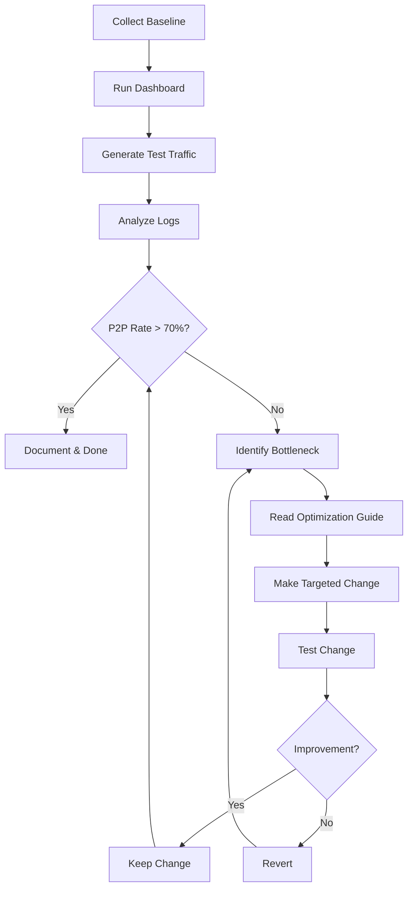

# P2P Optimization Workflow

This directory contains documentation and tools for analyzing and improving Wormzy's P2P connection success rate.

## Quick Start

### 1. Set up metrics collection

Ensure your relay server has Redis configured and metrics are being published:

```bash
# Check your relay configuration
echo $WORMZY_METRICS_REDIS
echo $WORMZY_REDIS_URL
```

### 2. Run the dashboard

```bash
cd cmd/dashboard
go run . -redis rediss://your-redis-url -refresh 5s
```

### 3. Generate test traffic

Follow the testing scenarios in `P2P-BASELINE-TEMPLATE.md`:

```bash
# Same LAN test
# Terminal 1
go run ./cmd/wormzy -mode recv -code test-lan 2>&1 | tee recv-lan.log

# Terminal 2
go run ./cmd/wormzy -mode send -file testfile.bin -code test-lan 2>&1 | tee send-lan.log
```

For durability testing, run a repeated matrix across payload sizes:

```bash
make build
./scripts/nat-durability.sh \
  --trials 50 \
  --payload-kibs 16,64,1024 \
  --relay https://relay.wormzy.io
```

This validates transfer churn and path selection on the current host. It is not
a strong NAT-punching test unless the peers are actually behind different NATs.

On Linux, use the namespace lab to put sender and receiver behind separate NATs:

```bash
sudo ./scripts/setup-nat-lab.sh up --mode cone
./scripts/nat-durability.sh \
  --trials 40 \
  --payload-kibs 16,64,1024,8192 \
  --send-ns nsA \
  --recv-ns nsB \
  --relay https://relay.wormzy.io
sudo ./scripts/setup-nat-lab.sh down
```

Repeat with `--mode symmetric`. Cone NAT should strongly prefer P2P; symmetric
NAT is expected to fall back to relay more often.

### 4. Analyze logs

```bash
./scripts/analyze-p2p-logs.sh -l recv-lan.log
./scripts/analyze-p2p-logs.sh -l send-lan.log
```

### 5. Record metrics

Copy `P2P-BASELINE-TEMPLATE.md` and fill in your results:

```bash
cp docs/P2P-BASELINE-TEMPLATE.md docs/P2P-BASELINE-$(date +%Y%m%d).md
```

## Files

- **P2P-OPTIMIZATION-GUIDE.md** - Comprehensive guide explaining timing, tuning, and analysis
- **P2P-BASELINE-TEMPLATE.md** - Template for recording baseline metrics
- **../scripts/analyze-p2p-logs.sh** - Helper script to parse transfer logs
- **../scripts/nat-durability.sh** - Matrix runner for repeated P2P durability trials

## Workflow



## Key Metrics

Focus on these dashboard metrics:

| Metric | Target | Action if Below Target |
|--------|--------|------------------------|
| P2P % | 70%+ | Check DirectOutcome distribution |
| Same-LAN P2P | 100% | BUG: Check candidate selection |
| quic-timeout rate | <20% | Consider longer relay fallback delay |
| no-response rate | <10% | Check STUN servers |

## Common Issues

### Issue: Relay used on same LAN
**Symptom**: Dashboard shows relay transfers where both peers on local network  
**Priority**: HIGH - this should never happen  
**Fix**: Check `preferLocal` logic in `internal/transport/dilation.go:58`

### Issue: High quic-timeout but connections work eventually
**Symptom**: DirectOutcome shows many quic-timeout, but some P2P succeeds  
**Priority**: MEDIUM  
**Fix**: Increase `relayFallbackDelay` from 4s to 6s+ in `transport.go:52`

### Issue: Consistent STUN failures
**Symptom**: Logs show "STUN error" repeatedly  
**Priority**: HIGH - blocks P2P entirely  
**Fix**: Check network UDP filtering, add more STUN servers

### Issue: Noise handshake failures
**Symptom**: QUIC connects but DirectOutcome = "noise-failed"  
**Priority**: HIGH - not a NAT issue, crypto problem  
**Fix**: Check version mismatch, key derivation

## Reading the Code

Start here to understand the P2P flow:

1. `internal/transport/transport.go:Run()` - Main transfer orchestration
   - Lines 200-240: ICE/STUN discovery
   - Lines 345-359: Punch packet loop
   - Lines 424-438: Dial attempt schedule
   - Lines 469-707: Race logic (direct vs relay)

2. `internal/transport/dilation.go` - Candidate selection
   - Lines 17-46: `buildCandidates()` - Advertise our addresses
   - Lines 48-122: `selectPeerCandidates()` - Choose peer's best addresses
   - Lines 124-137: `candidateRaceWeight()` - Priority scoring

3. `internal/stun/stun.go` - STUN discovery
   - Lines 53-101: `discoverIPv4()` - Parallel probe all servers
   - Lines 105-164: `probeServer()` - Single STUN query

## Testing Checklist

Before committing P2P changes:

- [ ] Run 10+ same-LAN transfers (should be 100% P2P)
- [ ] Run 10+ NAT-to-NAT transfers (target 70%+ P2P)
- [ ] Run 5+ mobile hotspot transfers
- [ ] Check dashboard metrics match expectations
- [ ] Verify no regressions in logs (new errors?)
- [ ] Document results in baseline file

## Getting Help

If P2P rate is unexpectedly low:

1. Check your Redis URL is correct (`WORMZY_METRICS_REDIS`)
2. Verify relay server is running and reachable
3. Test with `./scripts/analyze-p2p-logs.sh` to see detailed timing
4. Look for patterns in "Recent failures" dashboard panel
5. Capture packet trace with `tcpdump` if needed (see guide)

## References

- NAT traversal theory: `Nat-Punch.md`
- How wormzy works: `HOWITWORKS.md`
- Repository guidelines: `../AGENTS.md`
